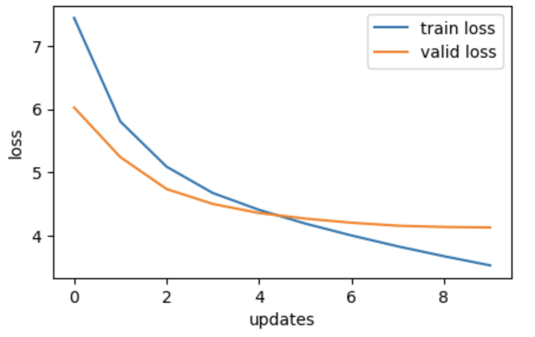
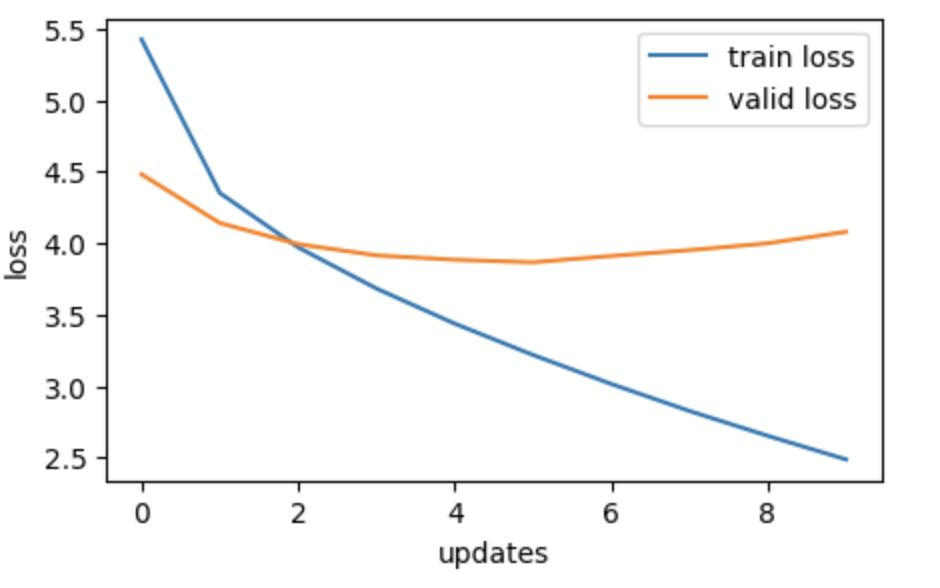
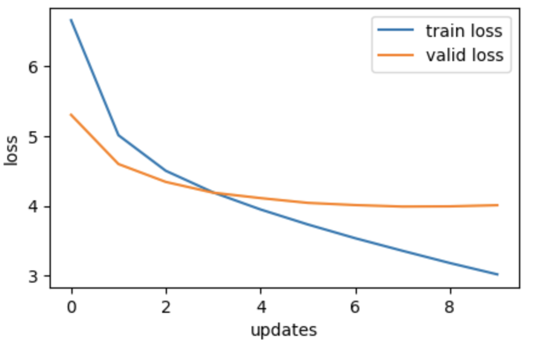
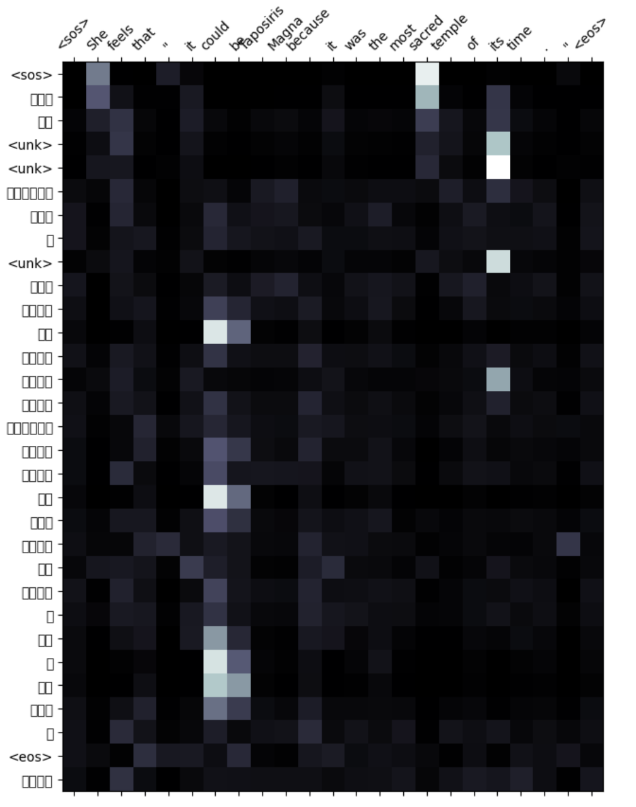
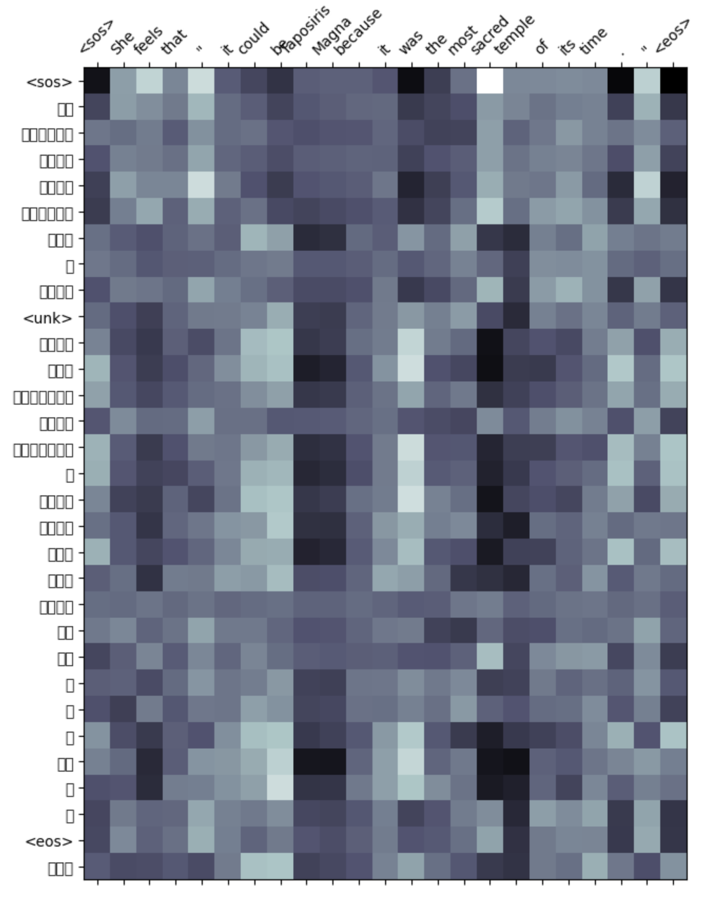
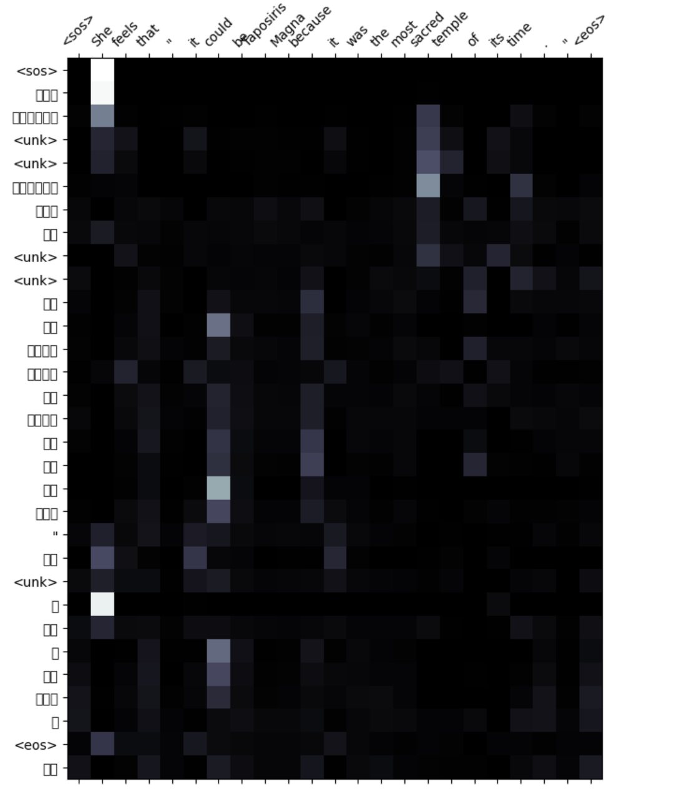

# NLP Assignment 3 (AIT - DSAI)

- [Student Information](#student-information)
- [Files Structure](#files-structure)
- [Task 1 - Get Language Pair](#task-1---get-language-pair)
   - [Dataset](#dataset)
   - [Preprocessing](#preprocessing)
   - [Tokenizing](#tokenizing)
- [Task 2 - Experiment with Attention Mechanisms](#task-2---experiment-with-attention-mechanisms)
- [Task 3 - Evaluation and Verification](#task-3---evaluation-and-verification)
   - [Performance Plots](#performance-plots)
   - [Attention Maps](#attention-maps)
   - [Result Discussion](#result-discussion)
- [Task 4 - Web Application](#task-4---web-application)
    - [How to run](#how-to-run)
    - [Usage](#usage)
    - [Documentation](#documentation)

## Student Information
 - Name: Myo Thiha
 - ID: st123783

## Files Structure
 - In the training folder, The Jupytor notebook files (training) can be located.
 - The 'app' folder include 
    - `app.py` file for the entry point of the web application
    - Dockerfile and docker-compose.yaml for containerization of the application.
    - `template` folder to hold the HTML pages.
    - `models` folder which contains Pytorch model exports and its metadata file.

## Task 1 - Get Language Pair

### Dataset
- Source: https://www2.nict.go.jp/astrec-att/member/mutiyama/ALT/
- The corpus consistis of text files for english and asian languages. I download text files with english and myanmar text.
- Then, I split it into training, validation and testing sets: 187641, 20850 and 23166 records respectively.

### Preprocessing
- Since the text files contain unwanted IDs, I extract only strings for both languages.
- After then, I concat and merge strings into a pandas dataframe.
- Then, I split it into three datasets: training, validation and test and export them as csv files.
- Finally, I upload the csv files to hugging face.

### Tokenizing
- To tokenize myanmar text, I am going to use `pyidaungsu` python library from https://pypi.org/project/pyidaungsu/
- It supports word level tokenization of myanmar text. 
- e.g. `pds.tokenize("ဖေဖေနဲ့မေမေ၏ကျေးဇူးတရားမှာကြီးမားလှပေသည်", form="word")`
- output: `>> ['ဖေဖေ', 'နဲ့', 'မေမေ', '၏', 'ကျေးဇူးတရား', 'မှာ', 'ကြီးမား', 'လှ', 'ပေ', 'သည်']`

## Task 2 - Experiment with Attention Mechanisms

| Attentions          | Training Loss | Training PPL | Validation Loss | Validation PPL | 
|----------------|-------------|---------------|---------------|--------------------|
| General Attention       |    3.53      |      34.17  |       4.13        |            62.24        |   
| Additive Attention          |   3.22       |  23.00   |        3.87 |         47.73      |    
| Multiplicative Attention |         3.36   |     28.70      |         3.99   |          54.12         |    

## Task 3 - Evaluation and Verification

### Performance Plots

#### General

#### Additive

#### Multiplicative

### Attention Maps

#### General

#### Additive

#### Multiplicative

### Result Discussion

- **Validation Scores**: 
  - The **Additive Attention** mechanism yields the lowest validation loss and perplexity, indicating better performance compared to the other mechanisms.
  - The **Multiplicative Attention** mechanism performs slightly worse than additive, while the **General Attention** mechanism performs the poorest.

- **Training Scores**:
  - The **Additive Attention** mechanism achieves the lowest training loss, indicating efficient learning during training.
  - The **General Attention** mechanism has a slightly higher training loss compared to the multiplicative mechanism.

#### Overall Effectiveness:

- The **Additive Attention** mechanism demonstrates superior performance in both training and validation metrics, making it the most effective choice for translating between the native language and English.
- The **Multiplicative Attention** mechanism performs reasonably well but falls short compared to the additive mechanism.
- The **General Attention** mechanism lags behind the others, suggesting it may not be as effective in capturing relevant information for translation.

#### Conclusion:

Based on the evaluation using validation perplexity and loss, along with consideration of training scores, the **Additive Attention** mechanism proves to be the most effective choice for translating between the native language and English.

## Task 4 - Web Application

### How to run?
 - Run the `docker compose up` in the app folder.
 - Then, the application can be accessed on http://localhost:8000
 - You will directly land on the "Home" page.

### Usage:
- Input: After you run the web app, there will be a textbox where you can type any english text.
- Output: after that, you can hit the 'Translate' button and you will see the translated myanmar text below.

### Documentation:

#### Components
- **Model**: 
  - The translation model is a sequence-to-sequence transformer.
  - It consists of an encoder and a decoder, each with multiple layers of self-attention and feedforward neural networks.
  
- **Flask Routes**:
  - `/`: Displays the homepage where users can input English text for translation.
  - `/translate`: Handles POST requests for translating English text to Myanmar.

#### Model Details
- Input Language: English (`en`)
- Target Language: Myanmar (`my`)
- Model Architecture:
  - Encoder:
    - Input Embedding Layer
    - Multi-Head Self-Attention Layers
    - Position-wise Feedforward Neural Networks
  - Decoder:
    - Output Embedding Layer
    - Multi-Head Self-Attention Layers
    - Multi-Head Encoder-Decoder Attention Layers
    - Position-wise Feedforward Neural Networks
- Model Parameters:
  - Input Dimension
  - Output Dimension
  - Hidden Dimension
  - Number of Encoder and Decoder Layers
  - Number of Encoder and Decoder Heads
  - Encoder and Decoder Dropout

#### Files
- `index.html`: HTML template for the web interface.
- `models/classes.py`: Contains the implementation of the sequence-to-sequence transformer model classes.
- `library/utils.py`: Utility functions for text preprocessing and tokenization.
- `models/meta-additive.pkl`: Pickled file containing metadata for text transformation.
- `models/Seq2SeqTransformer-additive.pt`: Pre-trained model weights.

#### Text Processing Details
- **Tokenizer**: The tokenizer for Myanmar text is provided by the `pyidaungsu` library.
- **Vocabulary Building**: The vocabulary for both English and Myanmar text is built using `torchtext.vocab.build_vocab_from_iterator` function.
- **Special Symbols and Indices**: Special symbols and their corresponding indices are defined for use in the model.
- **Text Transform**: A function `get_text_transform` is defined to transform raw strings into tensors indices for both source and target languages.